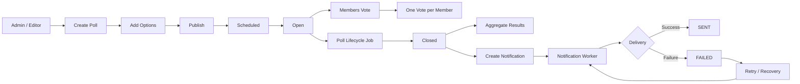
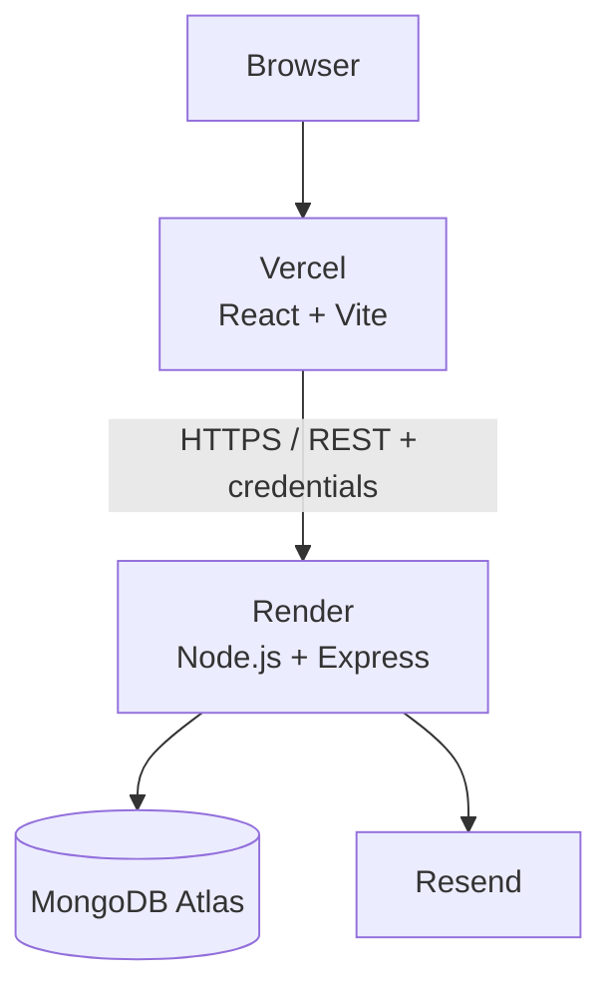
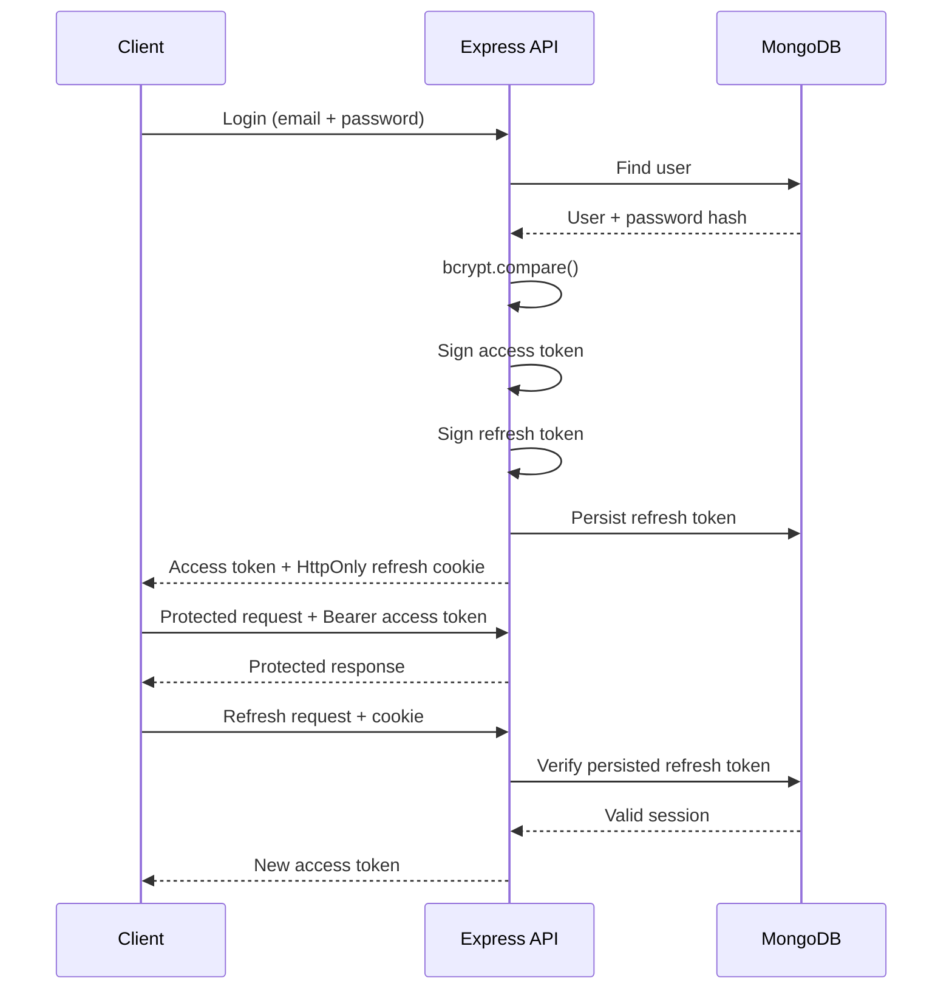
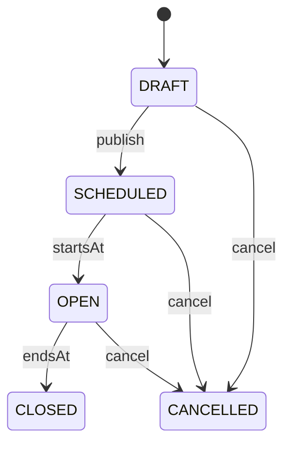
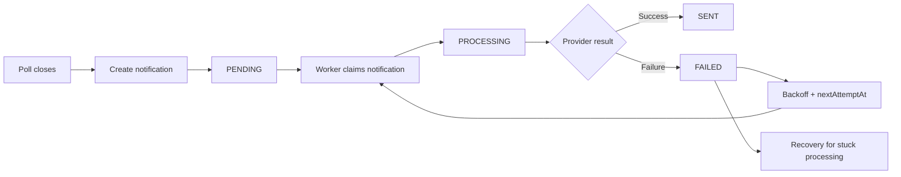

# UniMember

> **A production-ready university community platform for managing polls, member voting, results, roles, and reliable notifications.**
>
> Built as a full-stack engineering project with a strong focus on **security, business rules, maintainability, reliability, and production deployment**

<p align="center">
  
</p>

<p align="center">
  <a href="#-product-overview">Product</a> ·
  <a href="#-architecture">Architecture</a> ·
  <a href="#-security">Security</a> ·
  <a href="#-reliability">Reliability</a> ·
  <a href="#-deployment">Deployment</a> ·
  <a href="#-engineering-highlights">Engineering highlights</a>
</p>

<p align="center">

  
  
  
  
  
  
  
  
  
</p>

<p align="center">
  
  
  
  
</p>

---

## 🎯 Product overview

**UniMember** is a university/community platform designed around a concrete workflow:

- organizers create and manage course/community polls;
- members authenticate and vote once per poll;
- roles control which operations a user can perform;
- poll lifecycle is managed explicitly instead of relying on a simple `isActive` flag;
- results are calculated from MongoDB data with aggregation;
- closing a poll can create a notification for organizers;
- notification delivery is isolated behind a provider layer with retry and recovery behavior;
- the application is deployed as a real production system with a React frontend, Express API, MongoDB Atlas, and Resend.

The project started from a learning REST API and evolved into a **domain-oriented, production-deployed application**.

The objective is not to maximize the number of technologies. It is to use the right technology for the right boundary and make the system easier to evolve.

---

## Product workflow:



---

# Current Architecture

UniMember is split into a frontend application and a backend API, deployed independently.



### Application boundaries

```text
Browser
  ↓
React UI
  ↓
API client / React Query
  ↓ HTTPS
Express routes
  ↓
Middleware
  ├─ CORS / credentials
  ├─ authentication
  ├─ authorization
  ├─ validation
  ├─ rate limiting
  └─ security headers
  ↓
Controllers
  ↓
Services / domain logic
  ├─ MongoDB / Mongoose
  ├─ aggregation
  ├─ lifecycle logic
  └─ notification infrastructure
  ↓
External systems
  ├─ MongoDB Atlas
  └─ Resend
```

### Why this structure?

The main architectural rule is **separation of responsibilities**:

- **Routes** define the HTTP surface.
- **Middleware** handles cross-cutting concerns.
- **Controllers** translate HTTP requests into application operations.
- **Services** own business rules and orchestration.
- **Models** define persistence behavior and database constraints.
- **Providers** isolate third-party infrastructure.
- **Mappers / response shaping** keep API output intentional.

This keeps HTTP concerns from leaking into domain logic and makes infrastructure replaceable.

---

# ⚛️ Frontend architecture

The frontend is a React 19 + Vite application organized by feature rather than by a single large component tree.

### Main frontend technologies

| Technology                 | Responsibility                               |
| -------------------------- | -------------------------------------------- |
| React                      | UI and component composition                 |
| Vite                       | Development and production builds            |
| React Router               | Client-side routing                          |
| TanStack React Query       | Server-state fetching, caching, invalidation |
| Axios                      | HTTP client                                  |
| React Hook Form            | Form state                                   |
| Zod                        | Client-side schema validation                |
| Motion                     | UI transitions and interaction polish        |
| Tailwind / utility styling | Styling support                              |
| Bootstrap                  | Existing UI utilities                        |
| Lucide React               | Icons                                        |
| Oxlint                     | Static analysis / linting                    |

### Frontend feature boundaries

```text
frontend/src/
├── api/
├── app/
├── components/
│   ├── feedback/
│   ├── layout/
│   └── ui/
├── features/
│   ├── admin/
│   ├── auth/
│   ├── dashboard/
│   ├── notifications/
│   ├── polls/
│   ├── profile/
│   ├── public/
│   ├── results/
│   └── voting/
├── hooks/
├── styles/
└── main.jsx
```

The frontend also uses a permission-oriented UI abstraction (`RequirePermission` / `Can`) so the interface can hide operations users are not allowed to perform, while the backend remains the final authorization boundary.

---

# 🧩 Backend architecture

The backend intentionally follows a layered Express architecture.

```text
backend/
├── config/
├── controllers/
├── middleware/
├── models/
├── routes/
├── services/
│   └── provider/
├── Jobs/
├── validation/
├── utils/
├── tests/
├── script/
├── app.js
└── server.js
```

### Responsibilities

| Layer                | Responsibility                                                     |
| -------------------- | ------------------------------------------------------------------ |
| `routes/`            | HTTP routing and middleware composition                            |
| `middleware/`        | authentication, roles, validation, CORS, logging, errors, security |
| `controllers/`       | HTTP-level request/response handling                               |
| `services/`          | business logic and orchestration                                   |
| `models/`            | Mongoose schemas, indexes, persistence                             |
| `validation/`        | Joi request schemas                                                |
| `Jobs/`              | scheduled lifecycle/recovery/background work                       |
| `services/provider/` | external provider abstraction                                      |
| `utils/`             | shared mapping/retry/constants helpers                             |
| `config/`            | environment, database, CORS, cookies, role configuration           |

---

# Authentication

UniMember uses an **access-token + refresh-token** session model.



### Session design

**Access token**

- short-lived;
- returned to the client;
- sent through the `Authorization: Bearer ...` header;
- contains authenticated identity and role names.

**Refresh token**

- stored in an `HttpOnly` cookie;
- persisted server-side;
- used to issue a new access token;
- invalidated on logout.

This keeps long-lived session material out of JavaScript-accessible browser storage.

---

# Authorization & RBAC

Authentication and authorization are separate concerns.

```text
Request
  ↓
verifyJWT
  ↓
Authenticated identity + roles
  ↓
verifyRoles(...allowedRoles)
  ↓
Protected operation
```

Current business roles:

```js
const ROLES_LIST = {
  Admin: 5150,
  Editor: 1984,
  User: 2001,
};
```

Typical permissions:

| Capability                  |  User   | Editor | Admin |
| --------------------------- | :-----: | :----: | :---: |
| Vote                        |   ✅    |   ✅   |  ✅   |
| View active/open polls      |   ✅    |   ✅   |  ✅   |
| Manage polls                |   ❌    |   ✅   |  ✅   |
| Manage poll options         |   ❌    |   ✅   |  ✅   |
| Manage users / roles        |   ❌    |   ❌   |  ✅   |
| Notification administration | Limited |   ✅   |  ✅   |

The frontend uses permissions for UI behavior, but **backend RBAC remains authoritative**.

---

# Req validation

The API validates incoming requests with **Joi** before controllers execute.

```text
HTTP Request
   ↓
Joi schema
   ├── invalid → 400
   └── valid
         ↓
      Controller
         ↓
       Service
```

Validation covers authentication, polls, poll options, voting, notification operations, and query parameters.

The design intentionally separates:

> **Request validation** — “Is this payload structurally acceptable?”
>
> **Business validation** — “Is this operation allowed in the current domain state?”

---

# Voting integrity

The core business invariant is:

> **One member can vote only once per poll.**

The application checks for an existing vote, while MongoDB also protects the invariant with a unique compound index.

```js
voteSchema.index({ pollId: 1, userId: 1 }, { unique: true });
```

This creates two defensive layers:

```text
Application rule
      +
Database constraint
      ↓
One vote / user / poll
```

That matters under race conditions because application-level checks alone cannot guarantee uniqueness.

---

# Poll lifecycle

Polls use explicit states instead of a boolean `isActive` field.



Key domain rules include:

- draft/scheduled polls can be edited where allowed;
- open polls are protected from structural changes;
- closed polls are immutable;
- voting is accepted only while the poll is open and valid;
- publishing requires the configured number of options;
- cancellation preserves historical records.

Background lifecycle jobs move time-dependent polls forward without depending on a user request happening at exactly the right moment.

---

# Results and MongoDB aggregation

Results are calculated near the data instead of loading all votes into application memory.

```text
Poll
 ↓
Poll options
 ↓
$lookup / aggregation
 ↓
Vote counts
 ↓
Result projection
 ↓
Sorting
 ↓
Percentages / winner / tie detection
```

The result model preserves zero-vote options and treats ties explicitly rather than silently selecting an arbitrary winner.

---

# MongoDB performance engineering

MongoDB is treated as a data platform rather than a simple persistence layer.

The project uses and evaluates:

- unique indexes;
- compound indexes;
- query-driven index design;
- `lean()` where appropriate;
- aggregation pipelines;
- `.explain("executionStats")`;
- `COLLSCAN` vs `IXSCAN` analysis;
- `nReturned`;
- `totalKeysExamined`;
- `totalDocsExamined`;
- `executionTimeMillis`;
- notification worker indexes.

The engineering principle is:

> **Indexes are created from query patterns and verified with measurements.**

That is more useful for long-term performance than adding indexes indiscriminately.

---

# Notification subsystem

Notification delivery is deliberately separated from poll controllers.



### Reliability mechanisms

The notification subsystem includes:

- atomic claiming;
- retry attempts;
- exponential backoff;
- jitter;
- `nextAttemptAt` scheduling;
- `processingStartedAt` tracking;
- maximum-attempt protection;
- recovery of stuck processing records;
- uniqueness constraints;
- provider-level idempotency support.

### Provider isolation

```text
Notification Service
       ↓
Provider abstraction
       ↓
Email Provider
       ↓
Resend
```

This keeps the domain independent from a particular email vendor and leaves room for future channels.

---

# Error handling and observability

The backend uses centralized error handling rather than letting individual controllers define arbitrary production responses.

```text
Controller / Service
       ↓
    next(error)
       ↓
Central error handler
    ├── safe API response
    └── detailed internal log
```

Production clients receive controlled messages such as:

```json
{
  "message": "Internal server error"
}
```

while detailed stack traces remain in server-side logs.

The backend also avoids logging sensitive data such as passwords, JWTs, refresh tokens, authorization headers, and database credentials.

---

# Security posture

Security is implemented across multiple layers rather than treated as a single authentication feature.

### Implemented

- bcrypt password hashing;
- short-lived access tokens;
- refresh tokens in `HttpOnly` cookies;
- server-side refresh-token invalidation;
- role-based access control;
- request validation with Joi;
- ownership checks on sensitive operations;
- database uniqueness constraints;
- production CORS configuration;
- environment-based secrets;
- Helmet security headers;
- compression;
- `express-rate-limit`;
- `x-powered-by` disabled;
- centralized error handling;
- controlled production error responses;
- no sensitive authentication material in logs.

### Rate limiting

A global baseline limiter is configured around the API, with the option to apply stricter limits to sensitive endpoints such as authentication.

```js
const rateLimiter = rateLimit({
  windowMs: 10 * 60 * 1000,
  max: 100,
  standardHeaders: true,
  legacyHeaders: false,
});
```

The production goal is to slow abusive traffic without turning normal member activity into a poor experience.

---

# Testing and verification

The project includes a Jest/Supertest testing foundation and has been exercised through explicit integration/security scenarios.

Covered areas include:

```text
Authentication
├── register
├── login
├── protected requests
├── refresh
└── logout

Authorization
├── Admin
├── Editor
└── User restrictions

Voting
├── valid vote
├── duplicate vote
├── invalid option
├── wrong-poll option
└── closed-poll rejection

Poll lifecycle
├── Draft
├── Scheduled
├── Open
├── Closed
└── Cancelled

Notifications
├── delivery flow
├── retry behavior
├── atomic claim
├── failure handling
└── stuck-worker recovery
```

Production smoke testing was also completed against the deployed application.

> **Note:** the integration-test environment uses `mongodb-memory-server`; local execution depends on the MongoDB test binary being available to that package.

---

# Production deployment

UniMember is deployed as independent services:

| Component      | Platform      |
| -------------- | ------------- |
| Frontend       | Vercel        |
| Backend        | Render        |
| Database       | MongoDB Atlas |
| Email          | Resend        |
| Source control | GitHub        |

### Deployment flow

```text
GitHub
 ├── frontend → Vercel
 └── backend  → Render
                   ↓
             MongoDB Atlas
                   +
                 Resend
```

### Production configuration

The backend uses environment-based configuration for:

- database URI;
- JWT secrets;
- token lifetimes;
- frontend origin;
- email provider credentials;
- sender identity;
- server port and environment.

Secrets are not intended to be committed to Git.

### Health check

The backend exposes:

```http
GET /health
```

Expected response:

```json
{
  "status": "ok",
  "service": "UniMember API"
}
```

This gives the hosting platform a deterministic way to check application availability.

---

# 📦 Repository structure

The repository is a monorepo with independent frontend and backend applications.

```text
UniMember/
│
├── backend/
│   ├── config/
│   ├── controllers/
│   ├── middleware/
│   ├── models/
│   ├── routes/
│   ├── services/
│   │   └── provider/
│   ├── Jobs/
│   ├── validation/
│   ├── utils/
│   ├── tests/
│   ├── script/
│   ├── app.js
│   ├── server.js
│   ├── package.json
│   └── package-lock.json
│
├── frontend/
│   ├── src/
│   │   ├── api/
│   │   ├── app/
│   │   ├── components/
│   │   ├── features/
│   │   ├── hooks/
│   │   ├── styles/
│   │   └── main.jsx
│   ├── public/
│   ├── index.html
│   ├── vite.config.js
│   ├── package.json
│   └── package-lock.json
│
└── README.md
```

---

# Getting started locally

## Prerequisites

- Node.js 24 LTS for the backend;
- a MongoDB database for local development;
- a Resend account for email functionality when needed.

## Backend

```bash
cd backend
npm install
```

Create `.env` from the provided example and configure the development values.

Start development:

```bash
npm run dev
```

Start production mode locally:

```bash
npm start
```

## Frontend

```bash
cd frontend
npm install
```

Configure:

```env
VITE_API_URL=http://localhost:3500/api/v1
```

Start development:

```bash
npm run dev
```

Build for production:

```bash
npm run build
```

Preview the production bundle:

```bash
npm run preview
```

---

# API overview

Base path:

```text
/api/v1
```

### Authentication

| Method | Endpoint         | Purpose              |
| ------ | ---------------- | -------------------- |
| `POST` | `/auth/register` | Register member      |
| `POST` | `/auth/login`    | Authenticate member  |
| `POST` | `/auth/refresh`  | Refresh access token |
| `POST` | `/auth/logout`   | Invalidate session   |

### Polls and voting

| Method  | Endpoint                 | Purpose             |
| ------- | ------------------------ | ------------------- |
| `GET`   | `/polls/active`          | Current open poll   |
| `GET`   | `/polls/open`            | Open polls          |
| `GET`   | `/polls/:pollId`         | Poll details        |
| `POST`  | `/polls`                 | Create poll         |
| `PATCH` | `/polls/:pollId`         | Update poll         |
| `POST`  | `/polls/:pollId/options` | Add option          |
| `POST`  | `/polls/:pollId/votes`   | Cast vote           |
| `GET`   | `/polls/:pollId/my-vote` | Current user's vote |
| `GET`   | `/polls/history`         | Voting history      |
| `GET`   | `/polls/:pollId/results` | Poll results        |
| `POST`  | `/polls/:pollId/publish` | Publish poll        |
| `POST`  | `/polls/:pollId/close`   | Close poll          |
| `POST`  | `/polls/:pollId/cancel`  | Cancel poll         |

### Administration

| Method  | Endpoint                 | Purpose                 |
| ------- | ------------------------ | ----------------------- |
| `GET`   | `/users`                 | List users              |
| `PATCH` | `/users/:id/roles`       | Update roles            |
| `GET`   | `/notifications`         | Notification operations |
| `GET`   | `/notifications/history` | Notification history    |
| `GET`   | `/notifications/summary` | Notification summary    |

> Endpoint permissions are enforced by backend authentication and RBAC middleware. The frontend permission layer is not a security boundary.

---

# Engineering highlights

This project demonstrates more than framework knowledge.

### Domain modeling

Polls behave like a lifecycle-driven domain object rather than a CRUD document with an `isActive` flag.

### Defense in depth

Important invariants are protected by multiple layers:

```text
Validation
  +
Business rules
  +
Authorization
  +
Database constraints
```

### Reliability thinking

Notification delivery treats external infrastructure as unreliable by default and accounts for failures through retries, backoff, idempotency, and recovery.

### Query-aware database design

Indexes are evaluated from real access patterns and measured with MongoDB execution statistics.

### Infrastructure isolation

Third-party email delivery is hidden behind a provider boundary, reducing coupling to Resend.

### Production mindset

The application is not just runnable locally. It has:

- explicit production configuration;
- production hosting;
- health checks;
- secure cookies;
- CORS controls;
- security middleware;
- centralized error handling;
- rate limiting;
- background jobs;
- deployment separation between frontend and backend.

---

# Scalability considerations

The current architecture is intentionally suitable for a small-to-medium university/community workload while leaving clear paths for growth.

### Current scaling model

```text
Vercel frontend
      ↓
Single Render API instance
      ↓
MongoDB Atlas
```

The backend initially runs lifecycle and notification jobs in the same process. That is appropriate for the first deployment but should not be multiplied blindly across many API instances.

### Next scaling step

As traffic grows, the background jobs should move into a dedicated worker process/service:

```text
                ┌── API instances ────────┐
                │                         │
Load Balancer ──┤                         ├── MongoDB Atlas
                │                         │
                └─────────────────────────┘
                           │
                           ▼
                    Background Worker
                           │
                           └── Resend
```

This separates synchronous HTTP traffic from asynchronous work and prevents multiple API replicas from independently executing the same scheduled jobs.

### Future evolution

Potential next steps include:

- dedicated worker infrastructure;
- centralized structured logging;
- metrics and alerting;
- CI/CD quality gates;
- broader automated integration coverage;
- distributed tracing where justified;
- stronger database network isolation/private connectivity;
- auditing for sensitive administrative actions;
- CSRF hardening based on the final browser architecture;
- horizontal API scaling.

These are deliberate evolution paths, not mandatory complexity for the current product size.

---

# Engineering workflow

Development followed explicit acceptance-driven tickets:

```text
Requirement
   ↓
Acceptance criteria
   ↓
Implementation
   ↓
Manual / API verification
   ↓
Hardening / refactor
   ↓
Commit
   ↓
Deployment
   ↓
Production smoke test
```

That workflow helped the project evolve from a learning exercise into a deployable product without losing architectural clarity.

---

# Roadmap

### Completed

- Authentication and secure sessions
- Role-based authorization
- User and role management
- Poll management
- Poll lifecycle automation
- One-vote-per-member enforcement
- Results and winner/tie handling
- Voting history
- Notification delivery architecture
- Notification retries and recovery
- Request validation
- Production error handling
- Helmet / compression / rate limiting
- MongoDB performance work
- Integration/security test foundation
- Production deployment
- Production smoke test

### Deferred / future

- Avatar upload
- Dedicated background worker deployment
- Expanded observability and metrics
- CI/CD quality gates
- Additional notification providers/channels
- Larger-scale infrastructure and horizontal scaling

---
